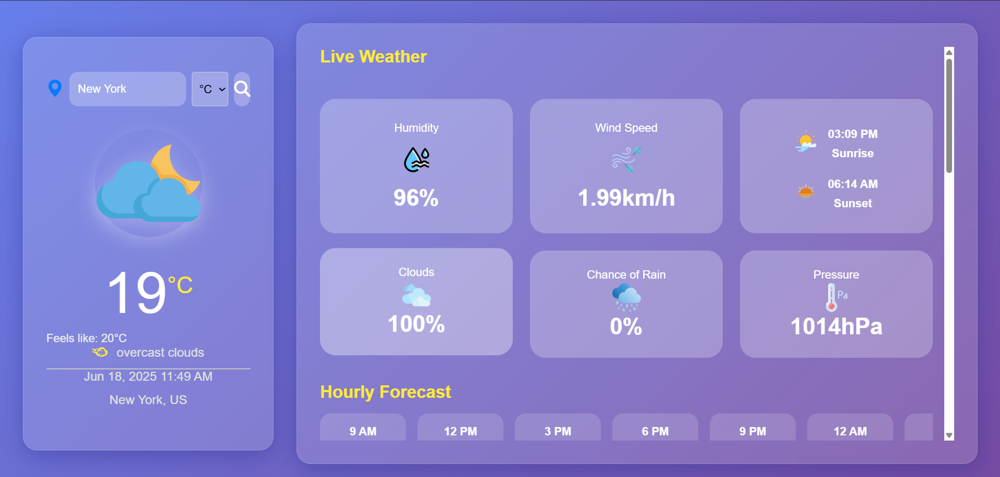
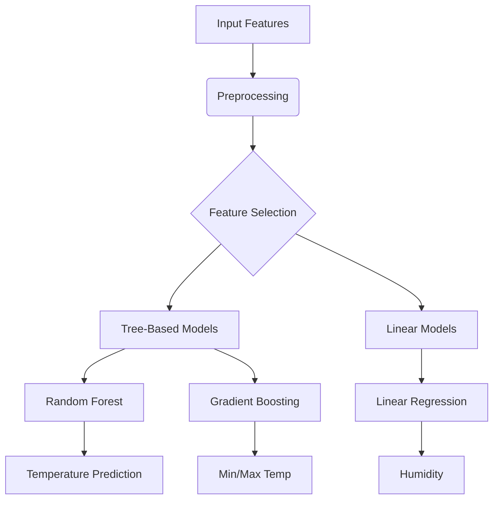
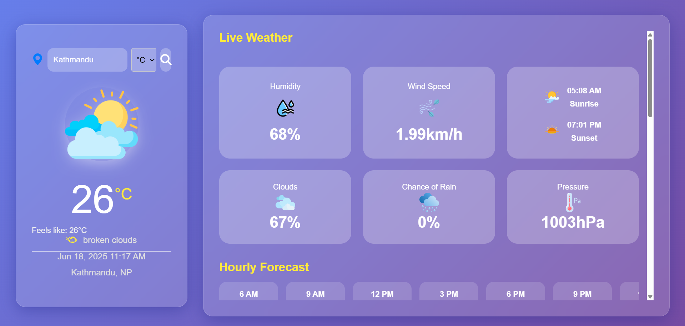
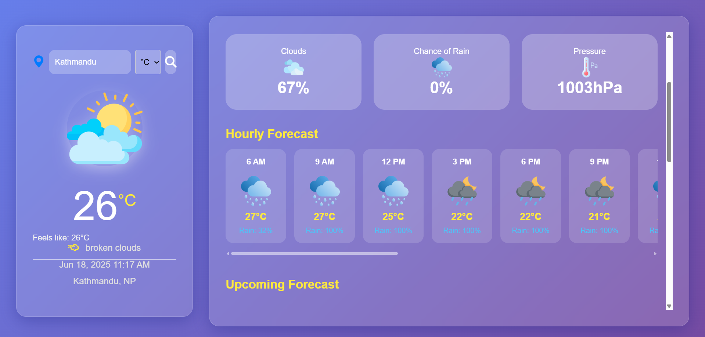
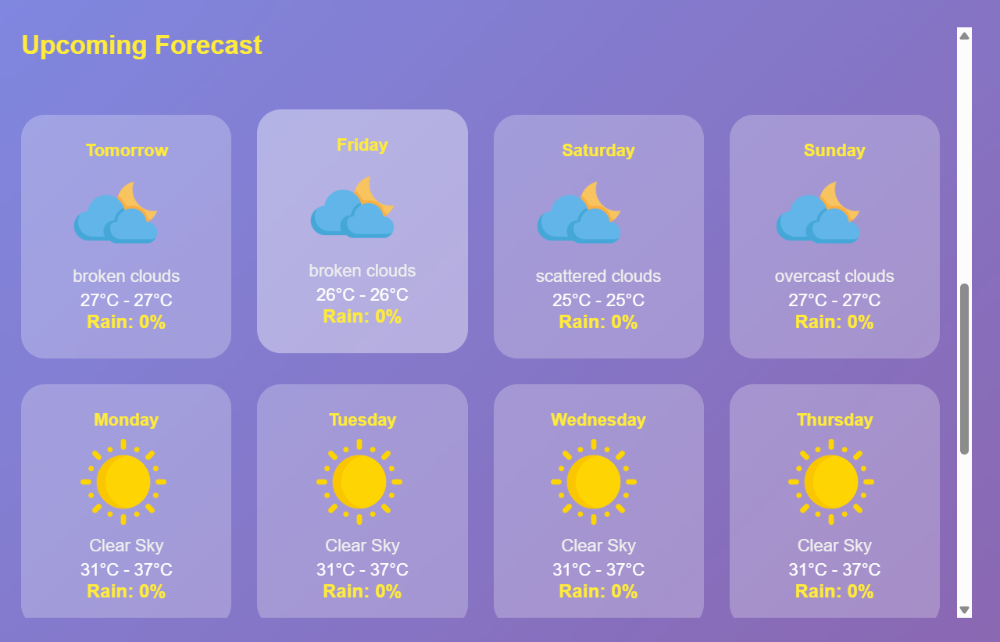
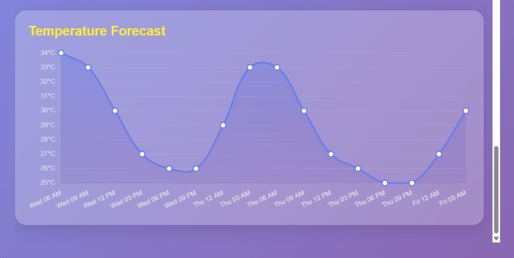

# Weather Forecast Application



## Table of Contents
1. [Project Overview](#project-overview)
2. [Features](#features)
3. [Technology Stack](#technology-stack)
4. [Installation Guide](#installation-guide)
5. [Models and Algorithms](#models-and-algorithms)
6. [API Integration](#api-integration)
7. [Screenshots](#screenshots)
8. [Contributing](#contributing)
9. [License](#license)

## Project Overview
A comprehensive weather forecasting application built with Django that provides:
- Real-time weather conditions
- 7-day forecasts with machine learning predictions
- Hourly weather updates
- Interactive temperature graphs
- Geolocation-based weather information

## Features
- **Current Weather Display**: Temperature, feels-like, humidity, wind speed, and more
- **Forecast Predictions**: 7-day weather forecast with min/max temperatures
- **Hourly Forecast**: Weather predictions for next 48 hours
- **Temperature Graph**: Interactive chart showing temperature trends
- **Unit Conversion**: Switch between Celsius and Fahrenheit
- **Geolocation**: Automatic weather detection based on user location
- **Responsive Design**: Works on mobile and desktop devices

## Technology Stack
- **Backend**: Django 4.1
- **Frontend**: HTML5, CSS3, JavaScript, Chart.js
- **Weather API**: OpenWeatherMap
- **Machine Learning**: Scikit-learn
- **Geolocation**: Browser Geolocation API
- **Database**: SQLite (development), PostgreSQL (production-ready)
- **Deployment**: Heroku, AWS, or any WSGI-compatible host

## Installation Guide

### Prerequisites
- Python 3.8+
- pip package manager

### Setup Instructions
```bash
# Clone the repository
git clone https://github.com/your-username/weather-forecast-app.git
cd weather-forecast-app

# Create virtual environment
python -m venv venv
source venv/bin/activate  # On Windows: venv\Scripts\activate

# Install dependencies
pip install -r requirements.txt

# Set up environment variables
echo "OPENWEATHER_API_KEY=your_api_key_here" > .env

# Apply migrations
python manage.py migrate

# Run development server
python manage.py runserver
```

Visit `http://localhost:8000` in your browser to access the application.

## Models and Algorithms

### Machine Learning Models
We use several regression models trained on historical weather data:

| Model | Prediction Target | Algorithm | Features Used |
|-------|-------------------|-----------|---------------|
| Temperature | Current Temperature | Random Forest | MinTemp, MaxTemp, Humidity, Pressure |
| Min Temperature | Daily Minimum | Gradient Boosting | Day of year, Humidity, Pressure |
| Max Temperature | Daily Maximum | Gradient Boosting | Day of year, Humidity, Pressure |
| Humidity | Humidity Level | Linear Regression | Temperature, Pressure, Wind Speed |

### Training Process
1. **Data Collection**: Historical weather data from various sources
2. **Feature Engineering**:
   - Date features (day of year, month, day of week)
   - Meteorological features (pressure, humidity, wind speed)
3. **Model Training**: Using Scikit-learn with 80/20 train/test split
4. **Evaluation**: Mean Absolute Error (MAE) and R² scores
5. **Persistence**: Models saved as .pkl files using joblib

### Algorithm Selection


## API Integration
The application integrates with the OpenWeatherMap API:

```python
def get_current_weather(city, api_key, unit="metric"):
    url = f"https://api.openweathermap.org/data/2.5/weather?q={city}&appid={api_key}&units={unit}"
    response = requests.get(url)
    data = response.json()
    
    # Process and return weather data
    return {
        "city": data.get("name"),
        "temperature": data["main"]["temp"],
        "humidity": data["main"]["humidity"],
        # ... other fields
    }
```

Key API endpoints used:
- Current Weather: `api.openweathermap.org/data/2.5/weather`
- 5-Day Forecast: `api.openweathermap.org/data/2.5/forecast`
- Geocoding: `api.openweathermap.org/geo/1.0/direct`

## Screenshots

### Main Dashboard


### Current Weather Display


### Hourly Forecast


### 7-Day Forecast


### Temperature Graph


## Contributing
We welcome contributions! Please follow these steps:
1. Fork the repository
2. Create a new branch (`git checkout -b feature/your-feature`)
3. Commit your changes (`git commit -am 'Add some feature'`)
4. Push to the branch (`git push origin feature/your-feature`)
5. Create a new Pull Request

## License
This project is licensed under the MIT License - see the [LICENSE](LICENSE) file for details.

---
